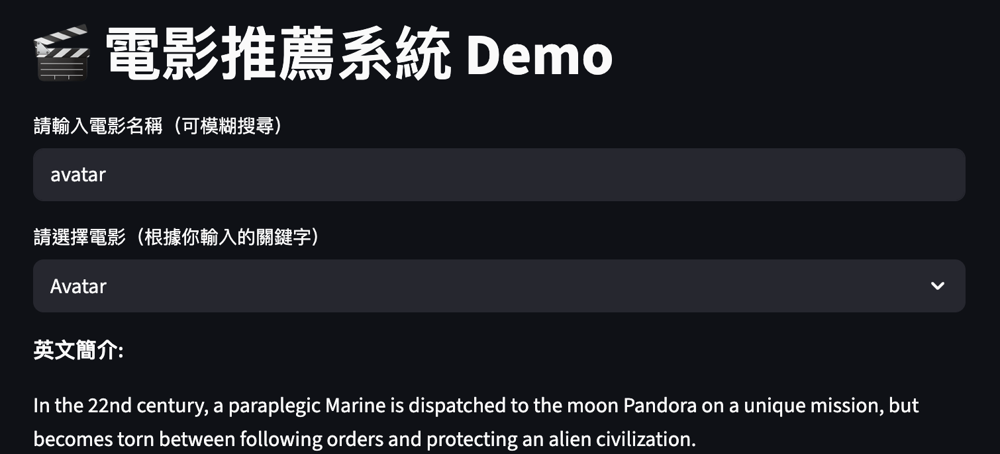
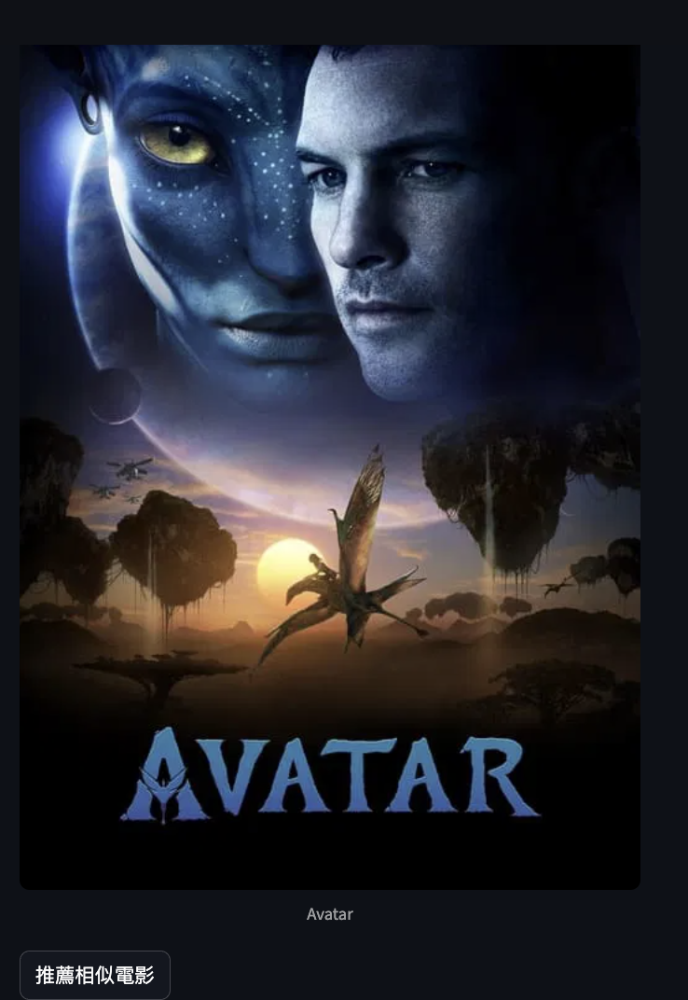
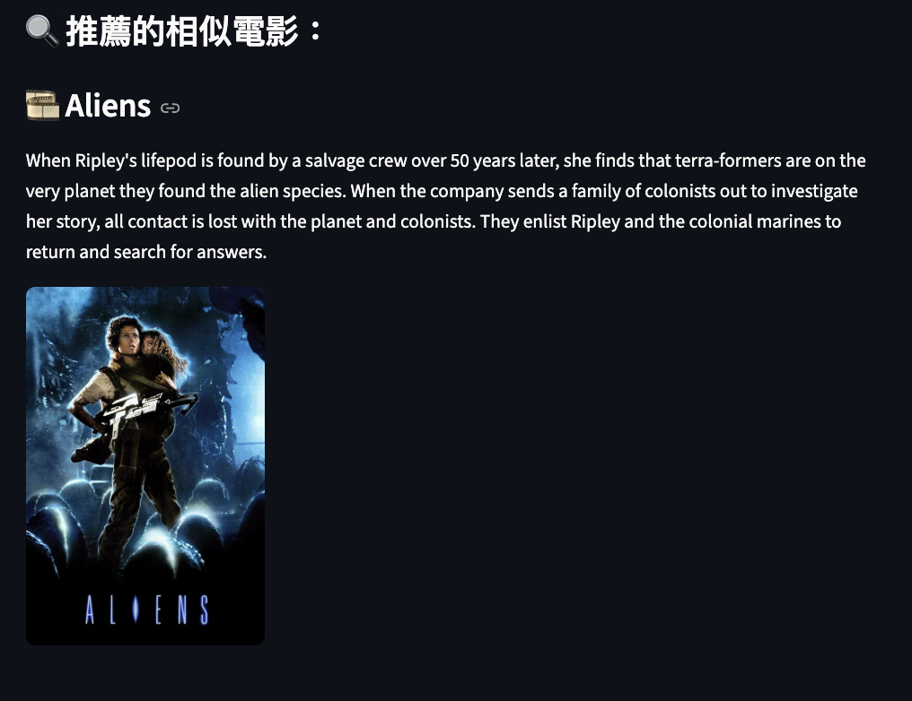

# 電影推薦系統 Movie Recommender

這是一個基於文字內容（導演、演員、類型）分析的電影推薦小工具，使用 Python 和 Streamlit 建立，並整合 TMDB API 抓取電影海報，提供使用者一個簡單互動的推薦介面。

---

## 功能介紹

- 支援模糊查詢電影名稱
- 顯示電影英文簡介與海報
- 基於文字內容（genre + overview）推薦相似電影
- 使用 Sentence-Transformers 語意嵌入模型提升推薦準確度
- 快取加速，體驗更順暢

---

## 安裝方式

### 1. 下載專案

```bash
git clone https://github.com/tingchen1992/movie-recommender.git
cd movie-recommender
```

### 2. 安裝套件

建議使用虛擬環境：

```bash
python -m venv venv
source venv/bin/activate  # Windows 請改用 venv\Scripts\activate
pip install -r requirements.txt
```

### 3. 設定 API 金鑰

請向 [TMDB 官網](https://www.themoviedb.org/) 申請 API 金鑰，並在根目錄下建立 `.env` 檔案，內容如下：

```
TMDB_API_KEY=你的API金鑰
```

---

## ▶️ 執行程式

```bash
streamlit run main.py
```

打開後即可在瀏覽器操作推薦系統。

---

## 使用畫面示意







---

## 技術重點

- Streamlit 建立互動式網頁應用
- Sentence-Transformers：語意向量嵌入模型
- Scikit-learn：計算餘弦相似度做推薦
- Pandas 資料前處理與合併
- TMDB API：即時抓取海報

---

## 資料來源

- Kaggle：TMDB 5000 Movie Dataset


